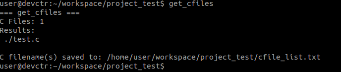

# helios

<a href="LICENSE" ></a>

A collection of tools for 42 curcus.

## Prerequisites

Ensure that [norminette](https://github.com/42School/norminette) is installed beforehand.

## Installation

Update the script permission, then run the installation script.

```bash
sudo chmod +x install.sh
./install.sh
```

## Tools

### normcheck

> Renamed from `checknorm`.

```
   _  ______  ___  __  ___  _______           __  
  / |/ / __ \/ _ \/  |/  / / ___/ /  ___ ____/ /__
 /    / /_/ / , _/ /|_/ / / /__/ _ \/ -_) __/  '_/
/_/|_/\____/_/|_/_/  /_/  \___/_//_/\__/\__/_/\_\ 

```

Summarises norminette check, and performs additional action(s) if specified.

```bash
normcheck [options]
```

**Options:**

- `-s`: Show source code of the file checked.
- `-m`: Build with make (experimental), run `make` after it passes norminette check. (Ensure that `Makefile` is present)
- `-h`: Help, display more options that could be used.

### get_cfiles

> Useful for getting the source files that would be used in the Makefile.



Concats all the `*.c` files within the current directory into an output file (`cfile_list.txt`).

```bash
get_cfiles
```